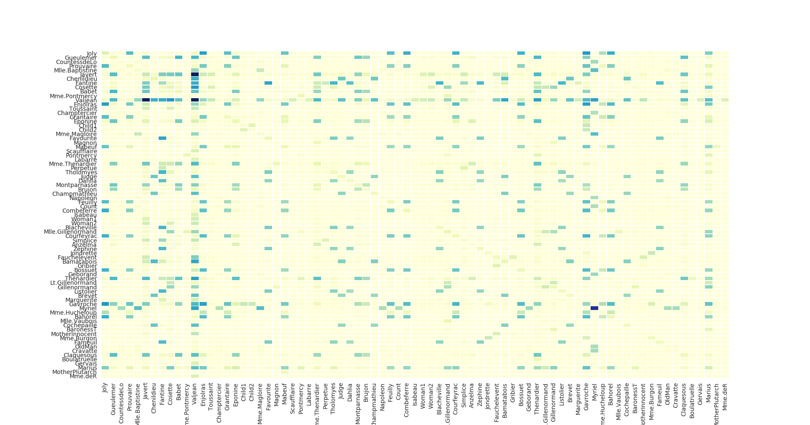

# Presentation

This is the implementation of a tensorflow operation to perform node2vec sequences generation from a graph stored in graphml format.

The operation returns the vocabulary of nodes, a walk, the epoch, the total number of sequences generated up to now, and the number of valid nodes. The vocabulary of nodes is a list of the nodes' id as found in the graphml file, and the list index is the node identifier in the walks. A walk is an array of integers representing the nodes. The epoch is the integer division of the number of generated sequences by the number of nodes in the graph. Valid nodes design nodes that have at least one neighbor, and for which we can generate n2v sequences.


## Cooccurrences of the characters for *Les Miserables*

See the script 


# Requirements

This operation depends on the Boost graph library. You have to download the lib, but you don't have to compile it though. Only the headers are used.

# Usage


First you have to compile the op. Just run `make` (this supposes that your boost headers are in `/usr/local/include`. It should generate a file called `node2vec_ops.so` that can be loaded by tensorflow in Python.

```
import tensorflow as tf
mod = tf.load_op_library("/path/to/graphseq_ops.so")
vocab, walk, epoch, total, nb_valid = mod.node2_vec_seq("path/to/your/file.graphml", batchsize=256, size=40)

with tf.Session() as sess:
    vocab_, = sess.run([vocab])
    epoch_ = 0
    while epoch_ < 10:
        walk_, epoch_ = sess.run([walk, epoch])

```

Here `walk_` will be a numpy array of size `(256, 40)` containing 256 walks of size 40.


# TODO

- Write **REAL** tests
- Support edge weight
- Support directed graphs
- Improve memory efficiency
- Give choice as to whether to compute edge aliases